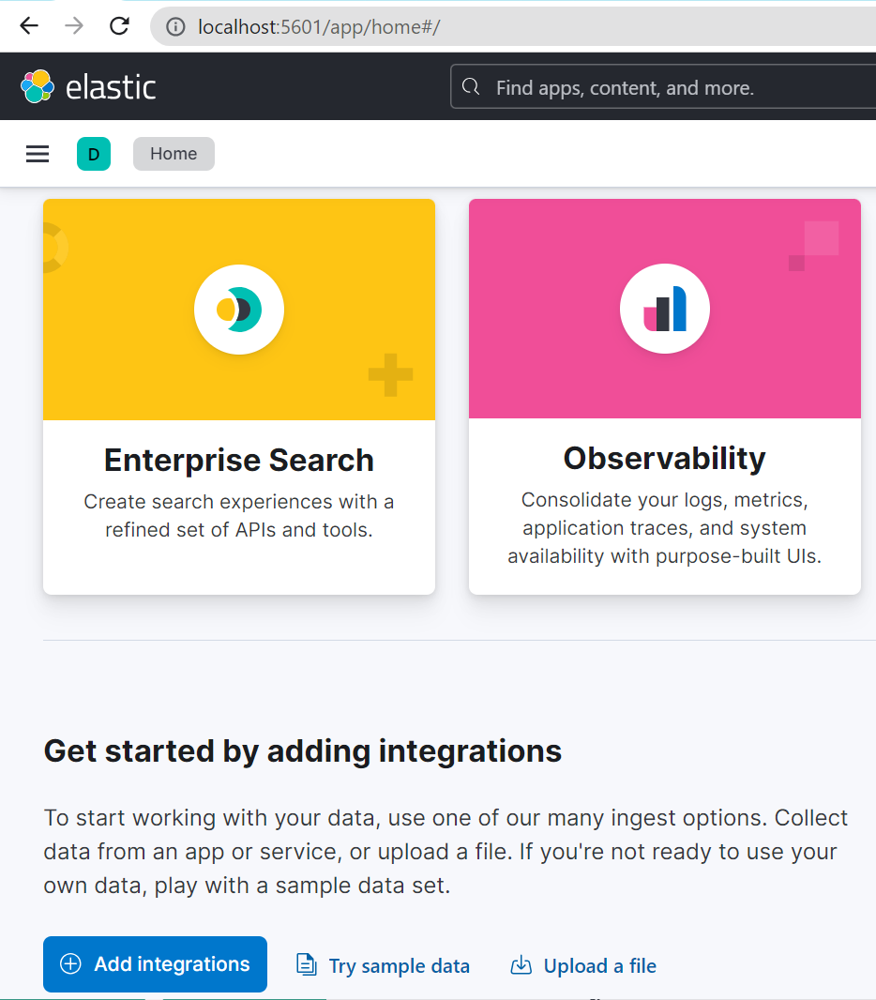
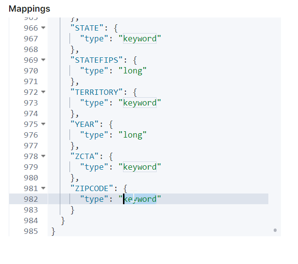
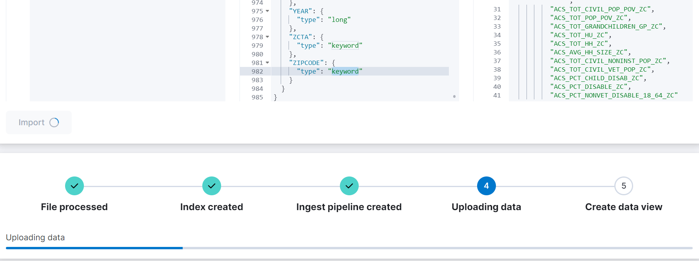

We will follow the instructions from the official guide from Elastic:
[https://www.elastic.co/guide/en/kibana/current/docker.html](https://www.elastic.co/guide/en/kibana/current/docker.html)
2. Download the docker images for Elasticsearch and Kibana.
From the command line run these commands:
Create a new Docker network
```shell
docker network create elastic
```
Pull the elasticsearch database image
````shell
docker pull docker.elastic.co/elasticsearch/elasticsearch:8.8.2
````
### Start elasticsearch in Docker

If your operating system is Windows run this first
````shell
wsl -d docker-desktop -u root
sysctl -w vm.max_map_count=262144
````
Launch the Elasticsearch server in Docker.
```shell
docker run --name es01 --net elastic  -e ES_JAVA_OPTS="-Xms1g -Xmx1g" -e NODE_NAME="es-01"  -p 9200:9200 -it docker.elastic.co/elasticsearch/elasticsearch:8.8.2
```
Same command but across multiline. Use either of the two.
```shell
docker run --name es01 \
--net elastic  \
-e ES_JAVA_OPTS="-Xms1g -Xmx1g" \
-e NODE_NAME="es-01"  \
-p 9200:9200 \
-it docker.elastic.co/elasticsearch/elasticsearch:8.8.2
```

After some time you  will see on the terminal the server password and enrollment tokens.
The output will look like this:
````shell

✅ Elasticsearch security features have been automatically configured!
✅ Authentication is enabled and cluster connections are encrypted.

ℹ️  Password for the elastic user (reset with `bin/elasticsearch-reset-password -u elastic`):
  xxxxxxxxxxxyyyyyy=

ℹ️  HTTP CA certificate SHA-256 fingerprint:
  38e11eab8e139b04b347d6adbdd37bbd8d068516b3547e5c3ec2c199d68b99f7

ℹ️  Configure Kibana to use this cluster:
• Run Kibana and click the configuration link in the terminal when Kibana starts.
• Copy the following enrollment token and paste it into Kibana in your browser (valid for the next 30 minutes):
 very-long-random-string....XYZ==  

ℹ️ Configure other nodes to join this cluster:
• Copy the following enrollment token and start new Elasticsearch nodes with `bin/elasticsearch --enrollment-token <token>` (valid for the next 30 minutes):
 another-long-random-string....XYZ== 
  If you're running in Docker, copy the enrollment token and run:
  `docker run -e "ENROLLMENT_TOKEN=<token>" docker.elastic.co/elasticsearch/elasticsearch:8.8.2`
━━━━━━━━━━━━━━━━━━━━━━━━━━━━━━━━━━━━━━━━━━━━━━━━━━━━━━━━━━━━━━━━━━━━━━━━━━━━━━━━━━━━━━━━━━━━━━━━━━
  
````

You will need the Kibana enrollment token in order to connect Kibana to the Elasticsearch Server

Note 1:
If you don't see the output above but rather some error messages then 
additional setup is needed and is documented at this page
[https://www.elastic.co/guide/en/elasticsearch/reference/current/docker.html](https://www.elastic.co/guide/en/elasticsearch/reference/current/docker.html)
Find the instructions for your respective operating system

Note 2:
If you need to regenerate the Kibana token:
```shell
docker exec -it es01 /usr/share/elasticsearch/bin/elasticsearch-create-enrollment-token -s kibana --url "https://localhost:9200"
```

For example for Windows before running the setup
#### Next we launch Kibana 
In a separate terminal window launch the Kibana instance 

Download Kibana image
```shell
docker pull docker.elastic.co/kibana/kibana:8.8.2
```
Start Kibana by running 
```shell
docker run --name kib-01 --net elastic -e ELASTICSEARCH_SSL_VERIFICATIONMODE="certificate" -p 5601:5601 docker.elastic.co/kibana/kibana:8.8.2
```
Same as the above but multyline command
```shell
docker run --name kib-01 \
--net elastic \
-e ELASTICSEARCH_SSL_VERIFICATIONMODE="certificate" \
-p 5601:5601 \
docker.elastic.co/kibana/kibana:8.8.2
```

When you start Kibana, a unique link is output to your terminal.
It will have the format
```shell
i Kibana has not been configured.

Go to http://0.0.0.0:5601/?code=123456 to get started.
```
Visit in your web-browser the url:
[http://localhost:5601/?code=123456](http://localhost:5601/?code=123456)

You will be prompted to enter the Kibana enrollment token that was generated when launching the Elasticsearch server.
Make sure to include the characters ```==``` at the end of the token.

Login to kibana using the username `elastic` and the password that was generated earlier. 

From the home screen follow the link to upload file

Also here is the direct link for the upload file
[http://localhost:5601/app/home#/tutorial_directory/fileDataViz](http://localhost:5601/app/home#/tutorial_directory/fileDataViz)


Upload the CSV file that you prepared earlier.

- For index name put `index-sdoh-2020` or something similar.
- Make sure to check the checkbox "Create Data View"

In the Mappings textfield will need to change the variable types for some of the fields.
Scroll to the very bottom and change the types from `long` to `keyword`  for the fields 
`"ZIPCODE", "ZCTA","STATEFIPS"`


Hit the import button at the bottom left part of the screen.


Once import completes click on the View index in discover 


In Discover you can explore your data as shown in the manual.
[https://www.elastic.co/guide/en/kibana/current/discover.html#explore-fields-in-your-data](https://www.elastic.co/guide/en/kibana/current/discover.html#explore-fields-in-your-data)